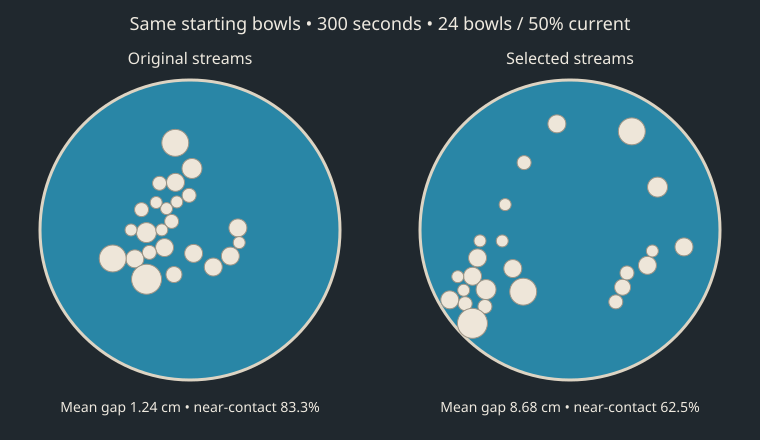

# Invisible stream tuning

Five-minute headless trials of the production Sim, at exactly 120 physics steps per simulated second (36,000 steps/trial). No enlarged timestep or substituted physics. Three inlet positions stay on the rim, 120° apart, pointing inward. The existing wall-flow turn remains active even in the no-stream control.

## Method

- 43 configurations; 3 matched layouts each (129 trials).
- Six leading candidates plus both controls: 20 new matched layouts each (160 trials).
- Selected configuration(s) and controls: 12/48 bowls at 50% current and 24 bowls at 25%/100% current, 5 new layouts per condition (60 trials).
- Primary condition: 24 bowls, 50% current. Steady search: speed 4–60 cm/s, width 12–65 cm, spread .1–1, reach 60–150 cm. Pulsed search: peak speed 20–90 cm/s, same width/spread/reach ranges, period 15–90s, duty .2–.7, phases 120 degrees apart. Speeds are at full current. Quadratic downstream decay; Gaussian cross-stream profile. Source and per-trial results record exact configurations.
- Rank = 70% score at 300s + 30% mean score sampled every 5s from 270–300s. Score = .65 mean nearest contact gap + .35 lower-quartile gap - .2 90th-percentile empty-space distance - 6 rim fraction - 4 near-contact fraction. Distances cm. Rim = <5cm wall clearance; near contact = gap <3cm.
- 349 total trials, 29.08 simulated hours; wall-clock 1.86 minutes using up to four worker processes.

## Held-out validation

Higher composite score and gap are better; lower clustering, rim fraction and empty-space distance are better. Negative scores are valid and have no absolute physical meaning.

| Configuration | Score | Mean nearest gap (cm) | Near-contact bowls | Rim bowls | Empty-space p90 (cm) | Mean speed (cm/s) |
|---|---:|---:|---:|---:|---:|---:|
| pulse-35 | -7.34 | 6.97 | 62.3% | 6.7% | 43.73 | 4.74 |
| pulse-38 | -7.77 | 5.71 | 59.6% | 5.0% | 44.13 | 5.48 |
| pulse-28 | -8.12 | 5.58 | 61.9% | 5.0% | 44.81 | 4.79 |
| pulse-2 | -8.25 | 5.20 | 62.5% | 7.1% | 43.20 | 4.45 |
| no-streams | -8.63 | 5.71 | 62.1% | 11.7% | 46.98 | 3.95 |
| short-steady | -8.89 | 5.24 | 67.1% | 0.4% | 46.38 | 4.87 |
| pulse-7 | -9.14 | 4.78 | 66.0% | 1.3% | 47.28 | 5.11 |
| baseline | -15.09 | 2.21 | 79.2% | 0.0% | 66.19 | 5.18 |

Winner: **pulse-35**, {"speed":30,"width":33,"spread":0.22,"reach":107,"pulsePeriod":70,"pulseDuty":0.47}.
Best nonzero streams: **pulse-35**, {"speed":30,"width":33,"spread":0.22,"reach":107,"pulsePeriod":70,"pulseDuty":0.47}.
Paired score improvement over original: 7.75; exploratory bootstrap 95% interval [7.06, 8.53], 20/20 layouts improved. The winner was selected using this validation set; the interval is descriptive, not an independent post-selection guarantee.

## Other settings (original → best active streams, or selected control in the initial run)

| Bowls | Current | Mean gap (cm) | Near-contact bowls | Score improvement |
|---|---:|---:|---:|---:|
| 12 | 50.0% | 3.11 → 16.90 | 86.7% → 41.7% | 15.52 |
| 48 | 50.0% | 0.57 → 2.42 | 95.4% → 77.9% | 5.88 |
| 24 | 25.0% | 1.40 → 5.03 | 90.0% → 66.7% | 9.28 |
| 24 | 100.0% | 3.72 → 6.69 | 72.5% → 55.8% | 5.13 |

## Limits

Best among tested configurations under the stated objective, not a global optimum. Five-minute sparseness does not measure subjective motion quality, sound quality, dragging, or longer-term behaviour. The final 30 seconds are sampled to reduce sensitivity to a lucky single frame. Gaps use the same size-dependent contact radii as the simulation.

The illustration uses seed 3001 (fixed first validation seed), not a hand-picked best result. All trial snapshots and scores are in results.json. Reproduce with `bun scripts/tune-streams.js`, then `bun scripts/summarize-streams.js`; add `--pulsed` to both commands for the pulse search.
