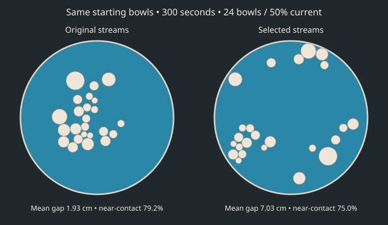

# Invisible stream tuning

Five-minute headless trials of the production Sim, at exactly 120 physics steps per simulated second (36,000 steps/trial). No enlarged timestep or substituted physics. Three inlet positions stay on the rim, 120° apart, pointing inward. The existing wall-flow turn remains active even in the no-stream control.

## Method

- 74 configurations; 3 matched layouts each (222 trials).
- Six leading candidates plus both controls: 20 new matched layouts each (160 trials).
- Selected configuration(s) and controls: 12/48 bowls at 50% current and 24 bowls at 25%/100% current, 5 new layouts per condition (40 trials).
- Primary condition: 24 bowls, 50% current. Steady search: speed 4–60 cm/s, width 12–65 cm, spread .1–1, reach 60–150 cm. Pulsed search: peak speed 20–90 cm/s, same width/spread/reach ranges, period 15–90s, duty .2–.7, phases 120 degrees apart. Speeds are at full current. Quadratic downstream decay; Gaussian cross-stream profile. Source and per-trial results record exact configurations.
- Rank = 70% score at 300s + 30% mean score sampled every 5s from 270–300s. Score = .65 mean nearest contact gap + .35 lower-quartile gap - .2 90th-percentile empty-space distance - 6 rim fraction - 4 near-contact fraction. Distances cm. Rim = <5cm wall clearance; near contact = gap <3cm.
- 422 total trials, 35.17 simulated hours; wall-clock 2.01 minutes using up to four worker processes.

## Held-out validation

Higher composite score and gap are better; lower clustering, rim fraction and empty-space distance are better. Negative scores are valid and have no absolute physical meaning.

| Configuration | Score | Mean nearest gap (cm) | Near-contact bowls | Rim bowls | Empty-space p90 (cm) | Mean speed (cm/s) |
|---|---:|---:|---:|---:|---:|---:|
| no-streams | -8.47 | 6.47 | 64.6% | 12.7% | 47.40 | 3.97 |
| candidate-69 | -8.79 | 5.17 | 65.2% | 0.8% | 46.38 | 4.80 |
| candidate-23 | -8.81 | 4.93 | 67.5% | 5.2% | 46.13 | 4.29 |
| candidate-41 | -8.89 | 5.13 | 66.7% | 2.3% | 47.11 | 4.53 |
| candidate-56 | -8.97 | 5.33 | 70.4% | 5.4% | 47.71 | 4.50 |
| candidate-13 | -9.12 | 5.07 | 72.9% | 0.6% | 46.06 | 4.71 |
| candidate-71 | -9.53 | 5.42 | 69.6% | 1.5% | 50.47 | 5.20 |
| baseline | -15.36 | 2.10 | 81.9% | 0.0% | 67.41 | 5.21 |

Winner: **no-streams**, {"speed":0,"width":32,"spread":0.6,"reach":150}.
Best nonzero streams: **candidate-69**, {"speed":27,"width":22,"spread":0.27,"reach":79}.
Paired score improvement over original: 6.88; exploratory bootstrap 95% interval [5.83, 7.94], 20/20 layouts improved. The winner was selected using this validation set; the interval is descriptive, not an independent post-selection guarantee.

## Other settings (original → best active streams, or selected control in the initial run)

| Bowls | Current | Mean gap (cm) | Near-contact bowls | Score improvement |
|---|---:|---:|---:|---:|
| 12 | 50.0% | 3.11 → 10.66 | 86.7% → 38.3% | 11.29 |
| 48 | 50.0% | 0.57 → 2.57 | 95.4% → 75.8% | 4.76 |
| 24 | 25.0% | 1.40 → 4.58 | 90.0% → 67.5% | 8.74 |
| 24 | 100.0% | 3.72 → 6.98 | 72.5% → 59.2% | 2.14 |

## Limits

Best among tested configurations under the stated objective, not a global optimum. Five-minute sparseness does not measure subjective motion quality, sound quality, dragging, or longer-term behaviour. The final 30 seconds are sampled to reduce sensitivity to a lucky single frame. Gaps use the same size-dependent contact radii as the simulation.

The illustration uses seed 1001 (fixed first validation seed), not a hand-picked best result. All trial snapshots and scores are in results.json. Reproduce with `bun scripts/tune-streams.js`, then `bun scripts/summarize-streams.js`; add `--pulsed` to both commands for the pulse search.
